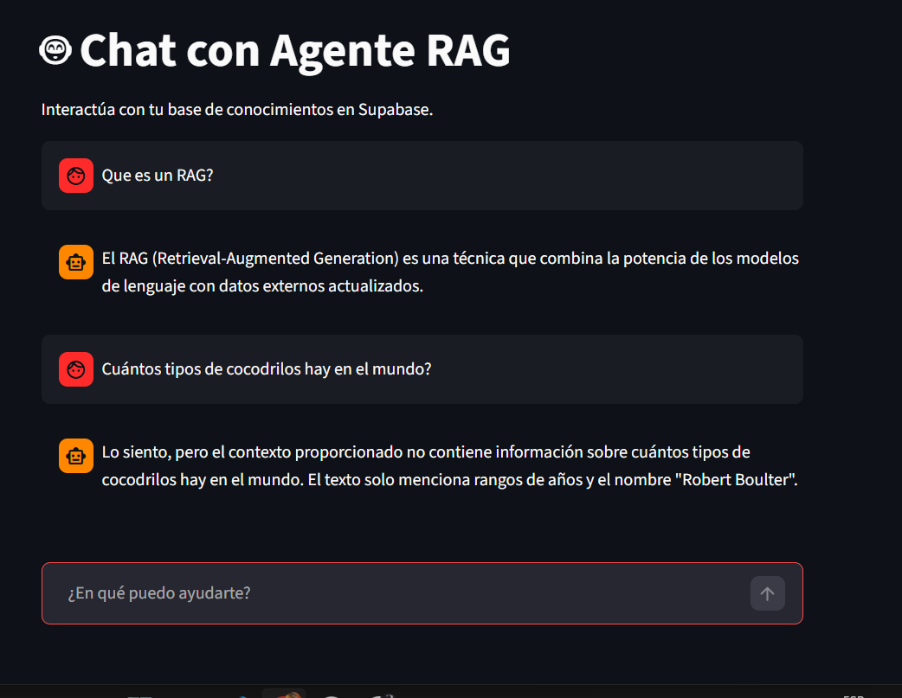
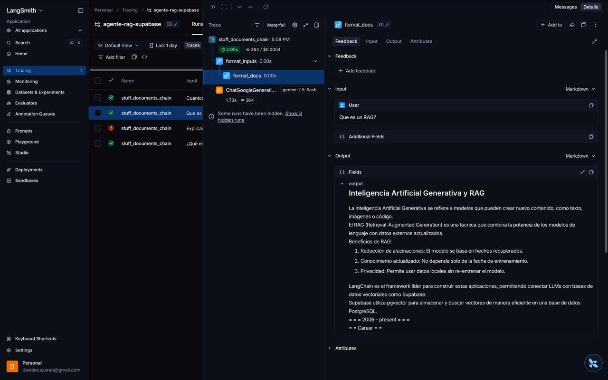
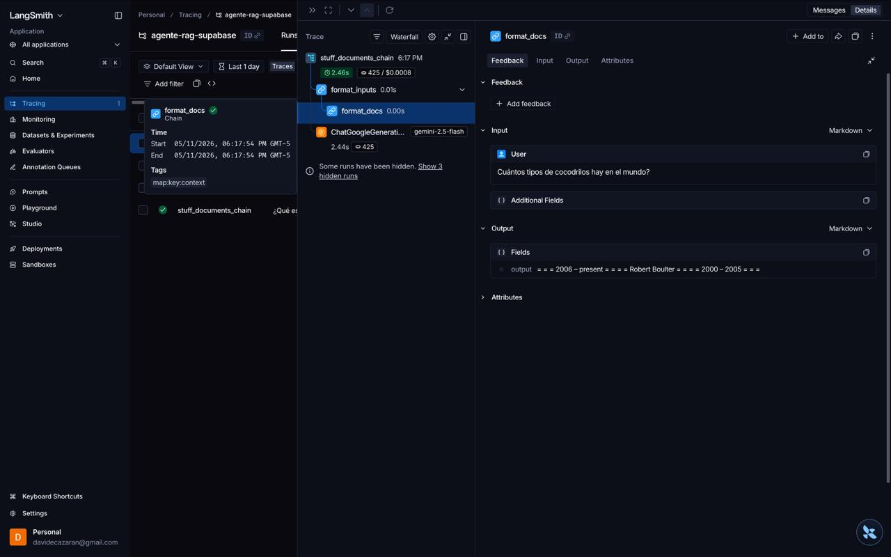

# Agente RAG con LangChain, Supabase y Ragas

Sistema de Retrieval-Augmented Generation (RAG) con interfaz conversacional, monitoreo y evaluación automática.

## 🏗️ Arquitectura del Proyecto
```
┌─────────────┐      ┌──────────────┐      ┌─────────────┐
│  Wikipedia  │─────▶│   Supabase   │◀─────│ Query Agent │
│   Dataset   │      │  Vector DB   │      │    (RAG)    │
└─────────────┘      └──────────────┘      └─────────────┘
                            │                      │
                            │                      ▼
                            │              ┌─────────────┐
                            └─────────────▶│  Evaluate   │
                                           │   (Ragas)   │
                                           └─────────────┘
```
```
Agente/
├── ingest/                  # Scripts de ingesta de datos
│   ├── ingest.py            # Ingesta de conocimiento.txt
│   ├── ingest_wikitext.py   # Ingesta de Wikipedia
│   └── conocimiento.txt     # Datos de ejemplo locales
├── evaluate/                # Scripts de evaluación y consulta
│   ├── query_agent.py       # Agente de consultas (CLI)
│   ├── evaluate.py          # Evaluación manual
│   ├── evaluate_with_json.py # Evaluación con JSON
│   ├── evaluate_synthetic.py # Evaluación sintética
│   └── evaluation_dataset.json # Dataset de prueba
├── ui/                      # Interfaz de usuario
│   └── app.py               # Front-end con Streamlit
├── docs/                    # Documentación adicional
├── .env                     # Variables de entorno
├── GEMINI.md                # Guía rápida para agentes AI
└── requirements.txt         # Dependencias
```

## 📋 Requisitos

- Python 3.10+
- Cuenta de Supabase (con pgvector habilitado)
- API Key de Google Gemini (modelo gemini-2.5-flash)
- API Key de LangSmith (opcional, para monitoreo)

## 🚀 Instalación y Configuración

1. **Entorno Virtual:**
   ```bash
   python -m venv venv
   source venv/bin/activate  # Windows: venv\Scripts\activate
   pip install -r requirements.txt
   ```

2. **Variables de Entorno (.env):**
   ```env
   GOOGLE_API_KEY=tu_api_key
   SUPABASE_URL=tu_url
   SUPABASE_SERVICE_KEY=tu_service_key
   LANGCHAIN_TRACING_V2=true
   LANGCHAIN_API_KEY=tu_api_key_langsmith
   ```

3. **Configurar Supabase:**
Ejecuta este SQL en tu proyecto de Supabase:

```sql
-- Habilitar la extensión pgvector
CREATE EXTENSION IF NOT EXISTS vector;

-- Crear tabla para documentos
CREATE TABLE documents (
  id BIGSERIAL PRIMARY KEY,
  content TEXT,
  metadata JSONB,
  embedding VECTOR(768)
);

-- Crear función de búsqueda por similitud
CREATE OR REPLACE FUNCTION match_documents(
  query_embedding VECTOR(768),
  match_threshold FLOAT,
  match_count INT
)
RETURNS TABLE (
  id BIGINT,
  content TEXT,
  metadata JSONB,
  similarity FLOAT
)
LANGUAGE SQL STABLE
AS $$
  SELECT
    documents.id,
    documents.content,
    documents.metadata,
    1 - (documents.embedding <=> query_embedding) AS similarity
  FROM documents
  WHERE 1 - (documents.embedding <=> query_embedding) > match_threshold
  ORDER BY similarity DESC
  LIMIT match_count;
$$;

-- Crear índice para búsquedas rápidas
CREATE INDEX ON documents USING ivfflat (embedding vector_cosine_ops)
WITH (lists = 100);
```

## 📖 Uso

### 1. Ingesta de Datos
Para que el agente tenga conocimiento, primero debes poblar la base de datos:
```bash
python ingest/ingest.py           # Datos locales
python ingest/ingest_wikitext.py  # Datos de Wikipedia
```

### 2. Interfaz de Chat (Recomendado) ⭐
Para tener una conversación fluida con el agente a través del navegador:
```bash
streamlit run ui/app.py
```



#### Comportamiento del RAG:
El sistema está diseñado para ser honesto y basarse solo en la información recuperada:
*   **Con Conocimiento:** Cuando la base de datos contiene la información, el agente responde detalladamente basándose en los documentos.
*   **Sin Conocimiento:** Si la pregunta no tiene relación con los datos ingestados, el agente informará que no tiene información al respecto para evitar alucinaciones.

### 3. Consulta por Consola
Para una prueba rápida en la terminal:
```bash
python evaluate/query_agent.py
```

### 4. Evaluación del Sistema
Mide la calidad de las respuestas (Fidelidad, Relevancia, etc.):
```bash
python evaluate/evaluate_with_json.py
```

## 📊 Monitoreo con LangSmith
Si configuraste LangSmith, puedes observar paso a paso cómo el sistema recupera la información y genera la respuesta.

### Traza con Información en RAG
Se observa cómo el sistema identifica documentos relevantes y los utiliza como contexto:


### Traza sin Información en RAG
Se observa que al no encontrar documentos con suficiente similitud, el sistema no entrega contexto al LLM o el LLM identifica la falta de datos:


Podrás ver estas trazas en tiempo real en: [smith.langchain.com](https://smith.langchain.com/)

## 🔒 Seguridad
Nunca compartas tu archivo `.env`. Asegúrate de que esté incluido en el `.gitignore`.

---
*Este proyecto fue organizado para soportar flujos RAG completos: Ingesta -> Conversación -> Evaluación.*
